# Glade buy/build decision graph — what depends on what

Date: 2026-09-12. Status: **dependency record for the owner; it orders questions,
it does not answer them.** Companion to [GladeBuyBuildMatrix.md](GladeBuyBuildMatrix.md)
(the Q-numbers) and [IrohGladeMapping.md](IrohGladeMapping.md) (the I-numbers).
The same graph is captured as a Gyld declaration,
[glade-decisions.gyld.py](/Users/owebeeone/limbo/gyld-wz/gyld/examples/glade-decisions.gyld.py),
and rendered at
[artifacts/glade-decisions-v1/decisions.svg](/Users/owebeeone/limbo/gyld-wz/gyld/artifacts/glade-decisions-v1/decisions.svg);
the capture checks that the dependency graph is acyclic and that every recorded
lean names exactly one alternative. Change the declaration and re-render when an
answer lands; this page is the reading aid.

## 1. Why a graph and not a tree

The thirteen matrix questions and the scope model do not branch from one root.
Four of them can be answered now, three hang from those, three more hang from the
second tier, five wait for a need or event that has not happened, and three become
live only if a particular branch is chosen. A tree would force an order that the
dependencies do not require; the graph shows what can be decided in parallel.

## 2. Tiers

| Tier | Question | Matrix | Depends on | Status and recorded lean |
|---|---|---|---|---|
| Anchors | iroh transport; discovery as a fold; grants as data; store seam; shape catalogue; Shaku | D-02, D-06, D-08, D-10, D-04, D-14 | ratified | Decided |
| Roots | Key custody posture | Q11 | nothing | Open; product decision |
| Roots | Async lifecycle composition | Q10 | nothing | Directed (GDL-049): sdax-rs; Tokio primitives are the fallback |
| Roots | Dissemination scope model | I-2 | anchors only | Lean: node trust for the fixed-peer slice |
| Roots | iroh version pin | Q2 | anchors only | Lean: bump to 1.2.0 now |
| Second | Transport-key binding | Q3 | key custody | Lean: a binding record under the node chain |
| Second | Capability proof family | Q6 | key custody | Lean: custom signed taut grants |
| Second | Shaku async witness | R27 | lifecycle composition | Open: pass confirms, fail reopens |
| Third | Relay and DNS posture | Q1 | transport-key binding, version pin | Lean: self-host both binaries |
| Third | Dissemination overlay | Q4 | scope model, transport-key binding, version pin | Lean: sync round only, gossip later and pinned |
| Third | Identity adapters | Q7 | proof family | Lean: none in v1 |
| Gated | Bulk transfer | Q5 | version pin; **gate:** first bulk supplier | Lean: iroh-blobs behind a port |
| Gated | Store engine | Q8 | store seam; **gate:** measured store pressure | Lean: whole-state blob until it hurts |
| Gated | Text CRDT engine | Q9 | shape catalogue; **gate:** an editing need the own profile cannot meet | Lean: own profile |
| Gated | Registry growth | Q12 | dissemination; **gates:** failure model, first real-route slice | Lean: trusted mapping only |
| Gated | Simulator and policy tooling | Q13 | **gate:** first real-route slice | Lean: own simulator only |
| Branch-induced | Traffic budget numbers | R5 | live if scope model = topology, or dissemination = gossip | Open |
| Branch-induced | Metadata exposure | R8 | live if scope model = node trust, or dissemination = gossip | Open |
| Branch-induced | Blind-relay tier | R14 | live if scope model = cryptography | Open |

Anchors are not questions; they are the ratified points the open questions hang
from, kept in the graph so that a change to one of them is visibly a change to
everything below it.

## 3. The branch points

Three alternatives reshape other questions rather than merely preceding them:

- **Scope model = topology.** One gossip instance per share with its own ALPN, so
  connections multiply per peer; that feeds the traffic budget numbers and the
  relay sizing in the relay posture.
- **Scope model = node trust.** Non-granted trusted nodes may learn share ids and
  heads; the metadata exposure question (GDL-010, WD-3) must be answered instead.
- **Scope model = cryptography.** Per-share payload encryption and the blind-relay
  tier (AZ-10) become real work before any overlay is adopted.
- **Dissemination = gossip overlay.** Raises the message-size bound into the traffic
  budgets and adds the same metadata exposure question under node trust.

## 4. The graph

```mermaid
flowchart TB
  classDef decided fill:#e2e8f0,stroke:#64748b
  classDef lean fill:#dcfce7,stroke:#64748b
  classDef open fill:#fef3c7,stroke:#64748b
  classDef directed fill:#dbeafe,stroke:#64748b
  classDef gate fill:#f8fafc,stroke:#94a3b8,stroke-dasharray: 4 3

  IrohTransport[iroh transport]:::decided
  DiscoveryFold[discovery fold]:::decided
  GrantsAsData[grants as data]:::decided
  StoreSeam[store seam]:::decided
  ShapeCatalogue[shape catalogue]:::decided
  Shaku[Shaku]:::decided

  KeyCustody[Q11 key custody]:::open
  Lifecycle[Q10 lifecycle composition]:::directed
  ScopeModel[I-2 scope model]:::lean
  VersionPin[Q2 version pin]:::lean
  Binding[Q3 transport-key binding]:::lean
  Proof[Q6 proof family]:::lean
  Witness[R27 Shaku async witness]:::open
  Relay[Q1 relay posture]:::lean
  Dissemination[Q4 dissemination]:::lean
  Identity[Q7 identity adapters]:::lean
  Bulk[Q5 bulk transfer]:::lean
  Store[Q8 store engine]:::lean
  Text[Q9 text engine]:::lean
  Registry[Q12 registry growth]:::lean
  Sim[Q13 simulator tooling]:::lean
  Budgets[R5 traffic budget numbers]:::open
  Metadata[R8 metadata exposure]:::open
  Blind[R14 blind-relay tier]:::open

  FirstBulk([first bulk supplier]):::gate
  Pressure([store pressure]):::gate
  Editing([editing need]):::gate
  Slice([first real-route slice]):::gate
  Failure([failure model]):::gate

  IrohTransport --> VersionPin
  IrohTransport --> ScopeModel
  GrantsAsData --> ScopeModel
  IrohTransport --> Binding
  KeyCustody --> Binding
  KeyCustody --> Proof
  GrantsAsData --> Proof
  Lifecycle --> Witness
  Shaku --> Witness
  Binding --> Relay
  VersionPin --> Relay
  ScopeModel --> Dissemination
  Binding --> Dissemination
  VersionPin --> Dissemination
  DiscoveryFold --> Dissemination
  Proof --> Identity
  VersionPin --> Bulk
  StoreSeam --> Store
  ShapeCatalogue --> Text
  Dissemination --> Registry

  FirstBulk -.-> Bulk
  Pressure -.-> Store
  Editing -.-> Text
  Failure -.-> Registry
  Slice -.-> Registry
  Slice -.-> Sim

  ScopeModel -. if topology .-> Budgets
  ScopeModel -. if topology .-> Relay
  ScopeModel -. if node trust .-> Metadata
  ScopeModel -. if cryptography .-> Blind
  Dissemination -. if gossip .-> Budgets
  Dissemination -. if gossip .-> Metadata
```

## 5. Reading it honestly

A lean is the assistant's recommendation on recorded evidence, repeated from the
matrix; a directed question carries an owner direction that still awaits its
witness or ratification; a starred alternative in the rendered graph is that lean
or direction, never a completed selection. Gates are events that make a question worth answering; answering a
gated question earlier is speculation, not foresight. Nothing here is a schedule:
the roots can be taken in any order or in parallel, and the tiers only say what
must be settled before a lower question stops moving. When a question is
answered, its status becomes Decided in the declaration and the questions below
it acquire a fixed point instead of an open one.
