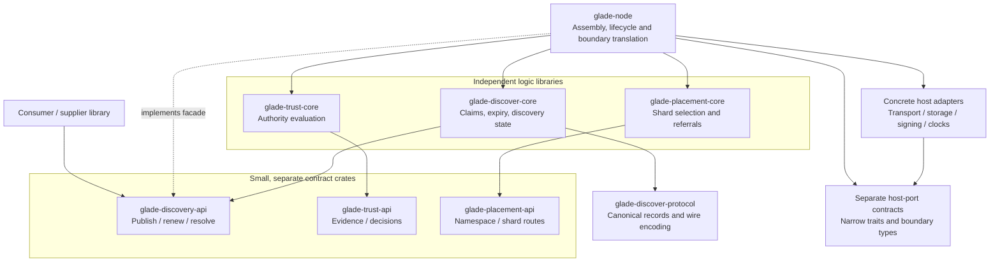

# Glade Package Architecture

Date: 2026-09-05. Owner: root engineering / Glade integration.

Status: **owner constraints recorded; package decomposition and rollout proposed**. No package extraction, new trust runtime, sharding implementation, or consensus adoption is implied by this document.

The reusable engineering requirements live in [LibraryBoundaryAndTestingPolicy.md](LibraryBoundaryAndTestingPolicy.md). This document applies them to Glade. Decision status is tracked under GDL-042/GDL-043 in [DecisionLog.md](DecisionLog.md); conversational provenance is in [GladeArchitectureDiscussion.md](GladeArchitectureDiscussion.md). The problem map remains [GladeProblemInventory.md](GladeProblemInventory.md).

## 1. Owner constraints

- Libraries MUST have minimal practical dependencies on other libraries.
- A non-trivial replaceable service MUST expose a meaningful contract; its implementation MUST be checked against that contract.
- Independent implementation changes MUST have a fast, isolated development test path. Whole-system suites MUST NOT be the mandatory local feedback loop for every minor change.
- Interfaces and their failure semantics MUST be subjects of TDD and conformance tests, not only type signatures.
- The system MUST be implementable in useful stages while trust policy develops as a separate problem.
- Package diagrams MUST distinguish desired structure from existing code, and compile-time dependencies from runtime cooperation.

The shared policy defines justified classifications for pure state machines and protocol/data packages. These MUST NOT acquire meaningless marker traits just to satisfy a rule. The machine-readable gate cannot decide which architectural role is appropriate; classification changes require review.

## 2. Current discovery package graph

Verified from the current Cargo manifests, not inferred from the proposed architecture:

```text
glade-discover-node-adapter -> glade-discover-core + glade-discover-protocol
glade-discover-sim          -> glade-discover-core + glade-discover-protocol
glade-discover-core         -> glade-discover-protocol
glade-discover-protocol     -> sha2
```

The simulator additionally depends on serde/serde_json. The core is a pure `step(state, ctx, event) -> (state, effects)` machine, with explicit clocks and trusted verification inputs. Claims, authority, routing and synchronization are modules within that crate, not separately compiled packages.

The node-adapter crate already declares `AppendHost`, `ClockHost`, `DurableCommit`, `EffectExecutor`, `ConsumerPolicy`, `DiscoveryRouter`, `ServiceManager`, and `Transport`. These are consumer-owned seams, currently colocated with their orchestration. The package architecture work starts by assessing those boundaries, not rewriting discovery as if they did not exist.

The current `glade/node/Cargo.toml` does not depend on the discovery workspace crates. A simulation/host-adapter proof is not evidence of a live, production Iroh integration.

An interface-only first tranche now exists alongside this original graph:
`glade-discover-transport-api`, `glade-discover-signature-api`, and
`glade-discover-operation-store-api` each depend only on protocol. They provide
draft async traits and opt-in reusable conformance assertions, not production
implementations or extracted/replaced host adapters. See
[DraftHostContracts.md](../glade-discover/dev-docs/DraftHostContracts.md) for
requirements, review findings, fast commands, and remaining decisions. The broader
discovery/trust/placement decomposition below remains proposed.

The follow-up [RegistryContractDraft.md](../glade-discover/dev-docs/RegistryContractDraft.md)
adds draft acceptance, registry, trust-policy and shard-location contracts with
canonical tests. Registry depends on acceptance for shared receipt types; otherwise
the four new contracts depend only on protocol. No production adapter, runtime,
wire-protocol change or demo cutover is part of either tranche.

Broader Glade contracts have now started separately in
[glade/contracts](../glade/contracts/README.md), beginning with a dependency-free
snapshot persistence trait and canonical tests. Five additional draft contracts
now cover application binding resolution, exchange invocation, subscription
opening/delivery, replica synchronization and resource lifecycle. See
[ApplicationContractDraft.md](../glade/dev-docs/ApplicationContractDraft.md) for
boundaries, canonical tests, review and explicitly unresolved integration work.
Its nested workspace explicitly adopts a local architecture gate; legacy Glade
crates and hosted CI are not covered by that adoption.

## 3. Proposed target structure

Names and extractions below are provisional. Solid arrows mean **compile-time dependency**; the dashed arrow means **implements the public facade**. Third-party dependencies are omitted except for their ownership at the concrete adapter boundary. The grouped host boxes each represent multiple separate packages, not a universal adapter or contract crate.



Transitive/API imports needed by assembly are elided. The diagram specifies intended ownership, not a complete Cargo manifest. In particular, whether the existing pure discovery core implements a public facade directly or is wrapped by an integration adapter remains a design decision. It MUST retain its deterministic event/effect boundary.

The node is the composition root: it selects implementations and translates evidence, requests and effects between boundaries. Pure implementations MUST NOT import each other's concrete packages. Callers of a public contract MUST NOT be forced to import the node executable or a transport/database implementation.

At runtime, an operation crosses caller -> public interface -> orchestration -> pure decisions -> host interfaces -> concrete I/O. Runtime cooperation does not require concrete implementation dependencies between the logic libraries. An in-process Rust trait does not substitute for the wire contract required by remote/non-Rust consumers.

## 4. Interface responsibilities

| Boundary | Intended contract | First useful implementation | Later augmentation |
|---|---|---|---|
| Registration/discovery | Publish/renew availability, resolve eligible candidates, report receipts and partial knowledge | One known namespace/group | Replicas, multiple shards, controlled reconfiguration |
| Trust | Identity, signature, scoped authority and evidence evaluation | Configured development root with real signatures/scoped grants | Delegation, renewal, revocation and disconnected freshness policy |
| Shard location | Map a namespace to authorized registry candidates | Fixed mapping | Authenticated referrals, locality, dynamic placement |
| Host ports | Explicit send, persistence, signing and clock outcomes | Small concrete adapters | Scheduling, recovery, additional storage/transport implementations |

The existing discovery authority checks MUST remain enforced during trust extraction. Policy authority continues to derive from authenticated records/folds; the node MUST NOT become a new hidden source of policy. Registry routing MUST NOT grant exclusive source-write authority.

## 5. Ephemeral registration boundary

The owner identified the registry as ephemeral and requested proven failure strategies. The proposed direction is renewable provider advertisements, local acceptance, and asynchronous replication. Exact publisher-facing receipt types and failure promises remain open under GDL-043; the discussion is not a ratified wire change.

Availability records, routing hints, and authority records have different lifetimes. A provider can renew/recreate its advertisement, while namespace delegation, grant/revocation evidence, source fencing, and restart/sequence protection are not disposable simply because a registry process is replaceable.

For the first integration, the existing v3.1 requirement MUST remain: persist the exact canonical signed operation before returning acceptance and emitting gossip. “Local acceptance” is not permission to replace this with memory-only success. A new memory-only profile would require an explicit versioned contract and tests. Peer replication confirmation is a separate receipt.

The proposed behavior keeps local registrations useful when peers are unreachable, retries idempotently, reconciles after partitions, and preserves original advertisement expiry during forwarding. Discovery returns eligible candidates, not proof that every service exists in the local view or is currently reachable. Source takeover and ownership coordination remain separate.

## 6. Proposed staged delivery

| Stage | Useful outcome | Gate |
|---|---|---|
| 0. Contract/inventory alignment | Map existing crates and behavior to shared policy; identify approved extractions | Architecture guard, named traits/ports, requirement-to-test mapping; preserve v3.1 invariants |
| 1. Real end-to-end slice | One namespace, fixed peers, provider advertisement, consumer discovery and call over Iroh | Genuine signing/verification, authorized and rejected cases, expiry, honest receipt, actual adapter tests |
| 2. Replica failures | Multiple replicas with asynchronous replication and renewal/retry | Partition/heal, lost acknowledgement, duplicates, restart, unavailable replica |
| 3. Static multiple shards | Authenticated namespace mapping and local preference | Stale/wrong referral, unauthorized registry, missing shard, bounded routing work |
| 4. Dynamic topology | Controlled movement/splitting/membership changes | Interrupted migration, conflicting authority, recovery, load/churn measurements |

Stages are proposals, not a registered execution plan or permission to change the frozen discovery contract. The separate trust workstream has not been launched. Each implementation step MUST begin RED and preserve all applicable existing guarantees; broader scope is not grounds to weaken them.

## 7. Fast checks and first enforcement

The first gate is local to `glade-discover` and covers library members of its primary Cargo workspace. It uses `architecture-policy.json`, a standalone syntax/metadata checker under `tools/architecture-check`, and `scripts/check-architecture.sh`. It does not add checker dependencies to the core or other production crates.

The local enforcement details, limits and requirement-to-test trace are recorded in `glade-discover/dev-docs/LibraryBoundaryChecks.md`. The existing full discovery test suite remains a separate system-assurance gate. No claim is made that other repositories or independently nested Cargo workspaces are already covered.

Contracts MUST have behavioral success/failure/edge tests. Structural checks cannot prove that a trait is architecturally meaningful, that tests assert the right behavior, or that a declaration is safe across every feature combination. Rust compilation and focused integration tests remain necessary.

Measured package feedback budgets and an automated affected-consumer selection mechanism are still open. Any initial recorded duration MUST distinguish warm checker runtime from cold compilation and from application tests. A lightweight architecture check is not a substitute for measuring the actual developer loop.

## 8. Unresolved decisions

- Exact package/API ownership and which current node-adapter ports merit extraction.
- Boundary data and evidence types without implementation-type leakage or a giant common-types package.
- Publisher receipt and replica-confirmation semantics; disconnected freshness and bootstrap recovery.
- Contract compatibility/version negotiation and feature-specific compiler witnesses.
- Per-library measured feedback budgets and affected-consumer CI selection.
- Adoption order for other repositories and review ownership for exceptions.
- Dynamic shard authority, reconfiguration and source fencing protocols.

Resolving these requires explicit decisions and tests. This document does not reopen GDL-032/036/037/041 or override the pinned discovery semantic freeze.
