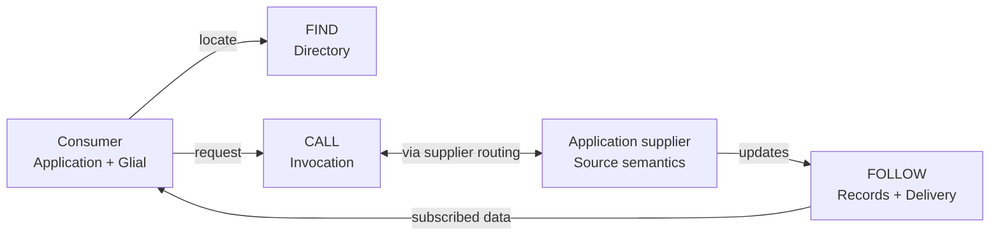

# Reading Glade without the full wiring graph

2026-09-09. A reading guide to candidate 1 revision 3, not a new decomposition.
The [Gyld declaration](/Users/owebeeone/limbo/gyld-wz/gyld/examples/glade-architecture.gyld.py)
remains the model. The diagrams below are intentionally selective explanations;
they are not literal wire paths, a complete dependency graph, or runtime evidence.
Display grouping changes no architectural boundary and introduces no scores/weights.

## 1. Start with what an application gets

Glade lets an application find a source, interact with it, and follow its data
without implementing peer networking and replica mechanics itself. Application
source semantics still belong to the application. Glial owns consumer-side assembly
and local-first behavior; remote Glade connectivity is optional for local use.

These are three capabilities, not three mandatory sequential steps. A configured
binding need not perform discovery for every call. This deliberately hides Sessions,
Admission, SupplierHost, transport and storage; it does not bypass them.

- **Find:** eligible providers and routing/freshness information. A directory result
  is neither an access grant nor proof the provider is reachable.
- **Call:** a directed operation on a supplier. Invocation owns correlation/routing;
  the supplier owns effects, fencing and durable command outcomes.
- **Follow:** Records owns profile-specific accepted history/reconciliation; Delivery
  owns interests and bounded distribution; Taut owns shape semantics; Glial assembles
  the consumer's local view. Not all shapes imply the same persistence guarantees.

## 2. Put the supporting responsibilities underneath

| Supporting question | Existing model participants |
|---|---|
| What does this request mean, and may it proceed? | Binding, Admission, Policy and Crypto; checks occur at the relevant operation/boundary, not just login |
| How does it connect to a peer, client or supplier? | Sessions, Iroh/WebSocket adapters and SupplierHost |
| What must survive, and who owns running work? | Storage capabilities, Runtime scopes, clocks, budgets and explicit cleanup |
| Who chooses and connects the implementations? | NodeAssembly using owner-selected Shaku |

Shaku is a construction/wiring tool. It is not the message router, a domain policy
engine, or an async shutdown supervisor. Most boxes initially describe libraries
inside one node process, not separately deployed servers.

## 3. Inspect only the relationships needed for the current question

The full export overlays participants, responsibilities, contracts, requirement
assertions, provider recipes, state and proof obligations. A line in it can mean
"must compile against", "provides", "shares", or "must drain before". Counting all
those lines as runtime communication makes the system look much more entangled.

Use these reading views, in order:

1. **Product:** find / call / follow, as above.
2. **One journey:** which participants cooperate for this operation and its failures?
3. **One component:** what narrow ports does it consume/provide, and what state does it own?
4. **Composition:** which provider and scope fills each port? This is Shaku's view.
5. **Assurance:** which requirements, failures and evidence constrain this boundary?

The information is retained in the full model; the first view need not display it.
This guide does not implement a new viewer or claim a mechanically lossless projection.

## 4. Where the real complexity still is

Directory metadata is itself a record profile: Directory does not need a separate
replication engine simply because discovery is special. DirectoryRules supplies pure
decisions; Records hosts acceptance/recovery; the live Directory facade serves users.
That reuse remains conditional on preserving discovery's existing atomic transaction.

Sharing an injector does not solve that semantic boundary. Nor does a shorter diagram
prove the architecture is sound. Review the profile/transaction boundary and async
ownership with executable witnesses; don't infer correctness from fewer boxes.

The next useful walkthrough is **Find**: a supplier advertises, the node checks and
accepts it, a consumer locates an eligible provider, and expiry/retry are explicit.
Keep Call/Follow's internals out of that walkthrough except where a shared contract
actually constrains it. The existing [build entry](../GladeBuildEntry.md) already
selects this registration/discovery slice; this is not a new implementation plan.
