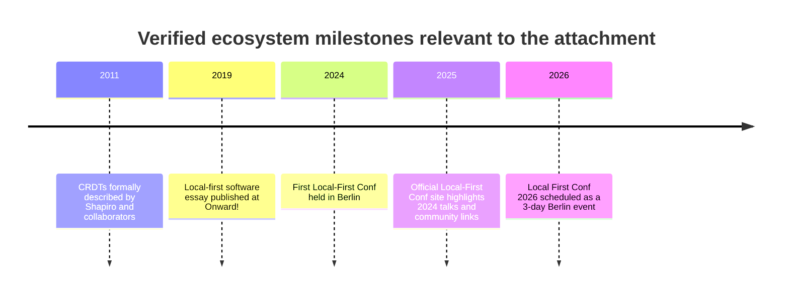

# Deep Research Review of the Attached Research Brief

## Executive summary

The attached material is a single plain-text research brief, not a dataset, PDF, image set, or study report. It contains a broad due-diligence agenda around Iroh/n0, browser-targeted Rust and WebAssembly, local-first architecture, CRDT libraries, and related communities. No OCR was required because the only attachment is already machine-readable text. fileciteturn0file0

The highest-confidence external findings are about the **local-first and CRDT ecosystem** rather than Iroh specifically. The local-first framing in the attachment is well grounded: the term was popularized by the 2019 *Local-first software* paper, and the community has since expanded into Local-First Conf, meetups, and related channels. citeturn56view0turn57view0turn57view1 The attachment’s comparative focus on Automerge, Yjs, Loro, and diamond-types is also directionally sound, but several claims need refinement: **Automerge** is explicitly a local-first sync engine for JS and Rust and separates transport/storage concerns via `automerge-repo`; **Yjs** is not properly described as “centralized-first,” because its own README says it is network-agnostic, supports p2p and offline editing, and is used in production by multiple apps; **Loro** positions itself as a high-performance local-first CRDT library with Rust and JS support; **diamond-types** is explicitly marked WIP, plain-text only, with its published Cargo package “quite out of date.” citeturn61view0turn61view2turn63view0turn53view0turn62view0turn62view1turn64view0

The weakest part of the brief is the **Iroh-specific due diligence**. In the retrieved source set, I could not verify several important Iroh claims the brief wants answered, including exact reasons for protocol de-scoping, the current Willow/RBSR relationship, browser/wasm maturity, API stability, and concrete production deployments. Those items remain open and should be treated as **unverified rather than false**. fileciteturn0file0

Methodologically, the brief is strong as a discovery agenda but weak as a reproducible review protocol: it lacks fixed inclusion criteria, definitions for terms such as “production-ready” or “isomorphic Rust,” and a scoring rubric for source quality.

## Attachments catalog

Only one attachment was supplied. It is a plain-text note containing a research agenda and working hypotheses about technology choices, ecosystem maturity, and example products to inspect. There are no embedded images, tables, charts, appendices, or formal bibliography entries in the file itself, and there are no non-text assets that require OCR or transcription. fileciteturn0file0

| Attachment | Type | OCR / transcription needed | Embedded figures or tables | Embedded citations | Notes |
|---|---|---:|---:|---:|---|
| `Pasted text.txt` | Plain text research brief | No | None observed | None formalized | Scope includes Iroh/n0, browser Rust/Wasm, Leptos/Dioxus/Yew, CRDT libraries, local-first communities, and example companies/products. fileciteturn0file0 |

The prior assistant’s outline—catalog attachments, extract text and metadata, identify themes and claims, cross-check against authoritative sources, and synthesize findings—matches the work product requested here. The attachment itself is therefore best understood as a **scoping memo**, not as evidence. fileciteturn0file0

## Extracted key points from the attachment

The file clusters around five recurring themes. First, it asks for due diligence on **Iroh/n0’s technical direction**, including whether Iroh abandoned aspects of earlier IPFS/libp2p-style thinking, how current Iroh components relate to Willow and range-based set reconciliation, and whether browser support is ready or still premature. Second, it asks whether **Rust/Wasm web frameworks** such as Leptos, Dioxus, and Yew are practically usable in production, especially for SPAs and isomorphic code. Third, it asks for a comparison of **local-first / CRDT choices** including Yjs/Yrs, Automerge, Loro, Iroh Docs, diamond-types, and adjacent tooling. Fourth, it asks for **example products and companies** that might prove out the approach, naming candidates such as 1Password, Cloudflare Workers, Zed, Figma, and Tailscale. Fifth, it asks for **community reconnaissance**, including Local-First Conf, localfirst.fm, Discords, and related discussion spaces. fileciteturn0file0

As a document, the attachment is internally coherent about its overall goal—deciding whether a browser- and local-first-friendly Rust stack is viable—but it mixes together several layers that should be separated during evaluation: application frameworks, sync engines, network transports, product examples, and communities. That layering mismatch matters later because many apparent “contradictions” are really category errors. For example, Yjs, Automerge, and Loro are sync/data-layer technologies, while Leptos/Dioxus/Yew are UI/runtime frameworks, and Tailscale is a network product rather than evidence of browser-Wasm app architecture. fileciteturn0file0

The brief also contains many **hypotheses phrased as tentative beliefs** rather than sourced claims. In practice, that means most of its strongest statements should be read as *questions to validate*, not *facts to inherit*. That distinction becomes especially important for Iroh-specific architecture claims, where the retrieved source set did not provide enough direct primary documentation to settle the major open questions. fileciteturn0file0

## Cross-check findings with sources and links

The most reliable externally verifiable part of the brief is the **local-first / CRDT foundation**. The concept of local-first software is indeed tied to the 2019 essay by Kleppmann, Wiggins, van Hardenberg, and McGranaghan, and the ecosystem has matured into an identifiable conference/community structure. citeturn56view0turn57view0turn57view1 CRDTs themselves trace back to formal work by Shapiro and collaborators in 2011, and subsequent community resources maintain active directories of implementations and discussion channels. citeturn26view3turn52view0turn54view1

The official or near-primary ecosystem sources also support a more nuanced comparison of the major sync libraries. **Automerge** describes itself as a local-first sync engine for multiplayer apps, says it works offline, preserves history, supports JS and Rust, and treats transport as orthogonal; its companion `automerge-repo` provides a backend option rather than hard-wiring a particular network architecture. citeturn61view0turn61view2 **Yjs** describes itself as network-agnostic, p2p-capable, offline-capable, with many editor integrations, and lists numerous production users; that directly weakens the attachment’s suggestion that Yjs should be viewed as inherently “centralized-first.” citeturn63view0turn54view0 **Loro** explicitly positions itself as a high-performance local-first CRDT library, implemented for real-time collaboration with Rust/JS support, P2P-friendly synchronization, and algorithms inspired by Event Graph Walker and Fugue. citeturn62view0turn62view1 **diamond-types** does verify several maturity caveats in the brief: it is a Rust text CRDT, supports browser/npm via Wasm, is still labeled WIP, and warns that the Cargo-published package is out of date. citeturn64view0

The attachment’s treatment of **communities** is broadly accurate. The CRDT community resource curated by Martin Kleppmann, Annette Bieniusa, and Marc Shapiro points to a `#crdt` channel in the dist-sys Slack and identifies the PaPoC workshop as a recurring in-person venue. citeturn54view1 The local-first community is also clearly real and active: the official conference site confirms a 2026 Berlin event, while the earlier conference page highlights 2024 talks and links to a Discord, newsletter, and `localfirst.fm`; the page also notes that Johannes Schickling hosts the podcast. citeturn57view0turn57view1

Where the brief becomes weaker is in its **example-product inference chain**. The strongest validation in the retrieved material is **Zed**, which the CRDT implementations directory explicitly describes as a high-performance, CRDT-based multiplayer editor that is open source and written in Rust. citeturn54view0 By contrast, the retrieved evidence does **not** substantiate the more ambitious idea that Tailscale, 1Password, Figma, or Cloudflare Workers serve as straightforward examples of “isomorphic Rust shared across browser, server, and native” for this use case. The Tailscale material I could retrieve describes a WireGuard-based system relying on NAT traversal and relay fallback, not a browser-Wasm shared-code application architecture. citeturn46view0

The brief’s **browser caution** is partly supported, but only at a general—not Iroh-specific—level. Retrieved sources indicate that browsers impose meaningful Wasm constraints around DOM access, CSP/`unsafe-eval`, debugging/tooling, and memory behavior on mobile; WebSocket remains the most universally compatible bidirectional browser transport, while QUIC/HTTP3 adoption does not automatically translate into general browser-friendly peer-to-peer QUIC stacks. citeturn45search1turn32search0turn34search0 This does not prove that an Iroh browser target is non-viable, but it does support the brief’s instinct to be cautious about labeling such a stack “production-ready” without direct evidence from official Iroh docs and release notes.

A concise timeline of the verified ecosystem milestones relevant to the attachment is below. The dates and events are supported by the cited sources immediately following the diagram. citeturn26view3turn56view0turn57view0turn57view1

### Claims versus verified sources

| Claim from the attachment | Finding | Evidence and linkable source |
|---|---|---|
| Local-first is a serious research/programming movement, not just a slogan | **Verified** | The 2019 local-first essay is the recognized origin point, and the movement now has a recurring conference/community footprint. citeturn56view0turn57view1 |
| CRDTs are central to local-first design | **Verified** | The local-first literature and CRDT community resources both identify CRDTs as a key technical foundation. citeturn56view0turn52view0turn26view3 |
| Automerge is local-first and transport-agnostic | **Verified** | Automerge’s official site says it is a local-first sync engine, and `automerge-repo` handles backend/network concerns separately. citeturn61view0turn61view2 |
| Yjs is basically centralized-first | **Contradicted / overstated** | Yjs’ own README says it is network agnostic, supports p2p and offline editing, and has many production users. citeturn63view0turn54view0 |
| Loro is a serious local-first contender | **Verified, but mostly via self-description and curated ecosystem listings** | Loro’s official site says it is high-performance, local-first, Rust/JS-capable, with P2P-friendly synchronization and explicit algorithmic choices. citeturn62view0turn62view1 |
| diamond-types is interesting but immature | **Verified** | The repo calls it WIP, text-only, and says the Cargo package is out of date. citeturn64view0 |
| Zed is a real Rust + CRDT production example | **Verified at a high level** | Curated CRDT ecosystem source lists Zed as a high-performance, CRDT-based multiplayer editor written in Rust. citeturn54view0 |
| Tailscale is a solid isomorphic Rust/browser-Wasm precedent | **Unsupported in retrieved sources** | Retrieved material documents Tailscale as WireGuard/STUN/DERP-based networking software, not as a browser-Wasm shared-code local-first application stack. citeturn46view0 |
| Iroh’s current architecture, browser maturity, and Willow/RBSR relationship are settled enough to rely on | **Unverified in retrieved source set** | The attachment raises valid questions, but I could not retrieve adequate primary Iroh sources here to resolve them confidently. fileciteturn0file0 |

## Methodological assessment

As a **research brief**, the attachment is useful because it asks the right kinds of questions: source verification, architecture maturity, ecosystem comparison, production evidence, and community health. It also appropriately asks for contradiction checks and prioritization of primary sources. Those are strong review-design instincts. fileciteturn0file0

As a **reproducible research protocol**, however, it is under-specified. It does not define key decision terms such as “mature,” “prod-grade,” “production-ready,” “isomorphic Rust,” “local-first,” or “centralized-first.” That omission matters because different source types answer different questions: a framework README can establish supported targets, but not operational reliability; a conference page can establish community activity, but not technical superiority; a GitHub repo can reveal maintenance signals, but not production adoption at scale. This matters especially in the CRDT space, where curated sources like CRDT.tech are excellent discovery aids but are not substitutes for independent benchmarks or architectural audits. citeturn53view0turn54view1turn61view0turn62view0turn63view0turn64view0

The methodological quality of the **external sources** used here varies by class. The 2011 CRDT work is foundational theory, strong for definitions and guarantees but not for product-tradeoff benchmarking. citeturn26view3 The 2019 local-first paper is better treated as a position paper or manifesto than as an empirical field study, which makes it influential for goals and framing but weaker for proving implementation choices. citeturn56view0 Official project sites for Automerge, Yjs, Loro, and diamond-types are primary sources for supported features, bindings, community channels, and maturity warnings, but claims like “fast,” “best,” or “high performance” are mostly self-reported unless corroborated independently. citeturn61view0turn63view0turn62view0turn64view0

In short, the brief is best used as a **decision memo seed**, not as a finished literature-review protocol. To support a serious architectural choice, it needs a clearly defined evidence hierarchy and a scoring rubric that separates: feature support, stability, adoption, performance, browser viability, and community resilience.

## Contradictions and uncertainties

The clearest contradiction I found in the retrieved sources is on the **Local-First Conf 2024 page** itself. The page title and “world’s first local-first conference” framing clearly refer to 2024, and it highlights 2024 talks and attendee/speaker counts, but the header also displays dates in May 2025. That looks like a site-labeling or page-reuse issue and should not be treated as a reliable standalone date source without cross-checking against the broader conference site or other records. citeturn57view0turn57view1

A second, more conceptual contradiction is in the attachment’s tendency to compare **different abstraction layers as if they were peers**. Yjs, Automerge, Loro, and diamond-types are sync/data-layer technologies; Leptos, Dioxus, and Yew are UI/runtime frameworks; Tailscale is networking infrastructure; and Figma or Zed are products. Some apparent disagreements disappear once the layers are separated. For example, Yjs can be both network-agnostic and often deployed with centralized infrastructure; those are not mutually exclusive claims. citeturn63view0turn61view0turn62view0

There is also a meaningful **terminology risk** around “CRDT” claims. The curated CRDT reference site explicitly notes that systems such as Google Docs, Trello, and Figma differ from CRDTs in that they require communication through a server rather than assuming decentralized operation. A secondary source on the CRDT page further characterizes Figma’s ordered-sequence handling as server-authoritative rather than a pure peer-style CRDT design. That means the attachment should not treat every collaborative product as interchangeable evidence for local-first P2P architecture. citeturn52view0turn26view3

The largest unresolved uncertainty remains **Iroh**. The brief asks the right questions, but in the retrieved source set I could not verify the high-value Iroh claims directly from official n0/Iroh documentation. That includes protocol history, the scope of browser/wasm support, relations to Willow/RBSR, API churn, and named production deployments. Those remain open and should be explicitly treated as pending primary-source verification rather than assumed true or false. fileciteturn0file0

## Recommended follow-up research and prioritized action items

The next step should be a **targeted primary-source sweep for Iroh/n0**. That should include official docs, release notes, blog posts, repo READMEs, issue trackers, and migration guides for `iroh`, `iroh-docs`, `iroh-gossip`, `iroh-blobs`, and any browser/wasm packages. The research question should be narrowed to a small set of auditable decisions: current architecture, browser target status, relationship to Willow/RBSR, stability guarantees, and real production users. Until that is done, the attachment should not be used to make a firm Iroh adoption decision. fileciteturn0file0

The second priority is to **define evaluation terms before comparing tools**. Create explicit criteria for: production readiness, browser readiness, isomorphic Rust, local-first compliance, transport assumptions, and maintenance signals. Without those definitions, comparisons between Yjs, Automerge, Loro, and diamond-types will continue to mix incompatible dimensions. The evidence collected here already suggests those projects occupy different points on the spectrum of maturity, scope, and architectural assumptions. citeturn61view0turn63view0turn62view0turn64view0

The third priority is a **structured decision matrix** with separate columns for data model, transport assumptions, browser compatibility, Rust support, JS/Wasm support, production users, maturity warnings, and community/maintenance signals. Based on the retrieved evidence alone, Automerge, Yjs, and Loro merit inclusion in that matrix; diamond-types should be included with an explicit “experimental / text-only / version caveat” flag; Zed should be treated as a product proof point for Rust + CRDT collaboration, not as a generic architecture template. citeturn61view0turn63view0turn62view0turn64view0turn54view0

The fourth priority is to **treat browser-Wasm viability as a separate workstream**. The general WebAssembly/browser evidence supports caution: there are still meaningful constraints around CSP, DOM access, tooling, and mobile memory behavior, and browser transport reality still privileges broadly supported web transports such as WebSocket over more specialized peer-oriented networking. That makes it risky to infer Iroh browser readiness from general enthusiasm around QUIC, HTTP/3, or Rust-to-Wasm alone. citeturn45search1turn32search0turn34search0

If a near-term decision is required *before* deeper Iroh verification, the prudent interim action is this: use the attachment’s ecosystem framing, but treat **Automerge, Yjs, and Loro** as the current high-confidence comparison set; treat **diamond-types** as exploratory; treat **Zed** as evidence that Rust + CRDT collaboration can work in practice; and treat **Iroh-specific conclusions as pending**.